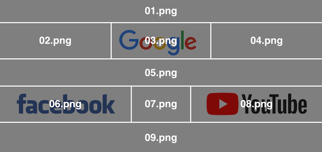
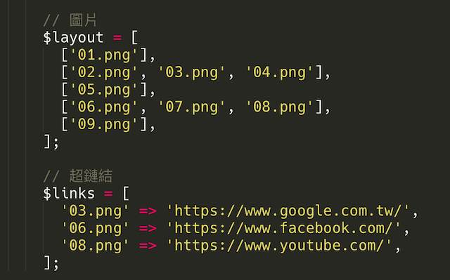
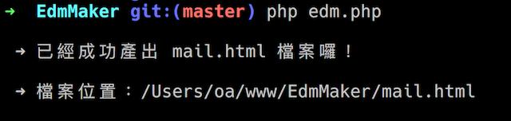
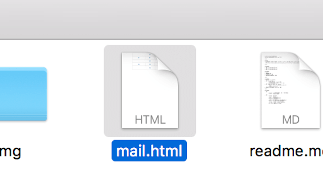

# Welcome To OA's EDM Maker!
使用 php 快速把圖片轉換成 EDM 的 html 工具！

 

## 聲明
本作品授權採用 [姓名標示-非商業性 2.0 台灣 (CC BY-NC 2.0 TW) 授權](http://creativecommons.org/licenses/by-nc/2.0/tw/)
，詳見 [http://creativecommons.org/licenses/by-nc/2.0/tw/](http://creativecommons.org/licenses/by-nc/2.0/tw/)

 

## 範例步驟
### 1. 原圖

### 2. 切割

### 3. 設定

### 4. 執行

### 5. 結果

## 使用條件
* Mac OS
* 電腦要能跑 php
* 圖片權限要可以 `讀取`
* 專案目錄資料夾權限要可以 `讀寫`

 

## 使用方法
* 將圖片放到 `img` 資料夾內
* 修改 `edm.php` 檔案
	* 依照需求排版調整 `$layout` 變數
	* 如有要超鏈結的區塊，則修改 `$links` 變數
* 打開 `終端機` 或 `瀏覽器` 執行 `edm.php`
	* 瀏覽器：`http://127.0.0.1/path../edm.html`
	* 瀏覽器：`php edm.html`
* 檢視目錄，若成功則會出現 `mail.html` 檔案

 

## 參數說明
* 變數
	* $layout - 由上而下的版型圖片，一個 [] 可以多個圖片
	* $links - 設定圖片的超鏈結
* 常數
	* IMGDIR - 圖片資料夾
	* ISMINI - 是否壓縮 html
	* DEBUG - 是否檢視超鏈結是否正常
	* CONTENT - 信件內容文字
	* WIDTH - 寬度，若無設定以第一列圖片寬度總和為主
	* BASEURL - 圖片網址，若無則以相對位置顯示
	* IMGLINK - 圖片使用 # 超鏈結，若無則不使用
	* LN - 換行，若壓縮 html，則不換行